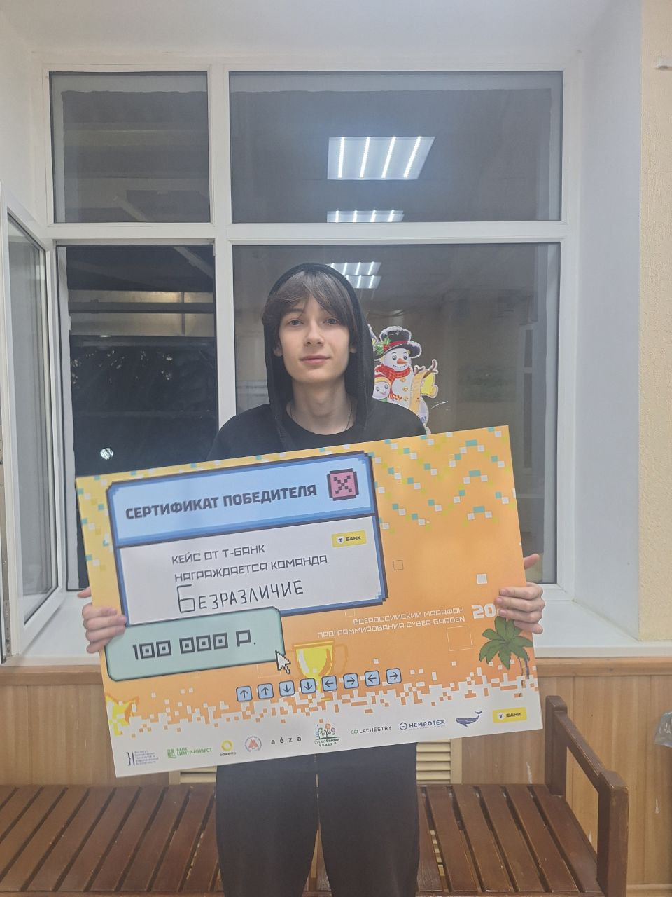
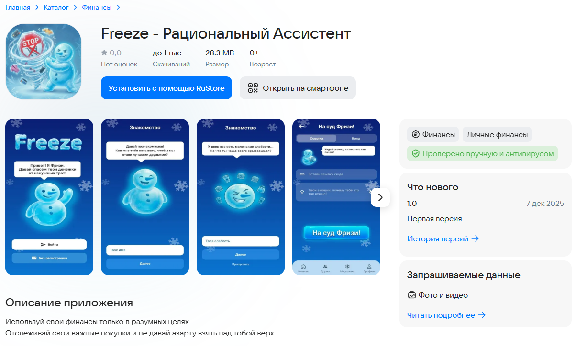
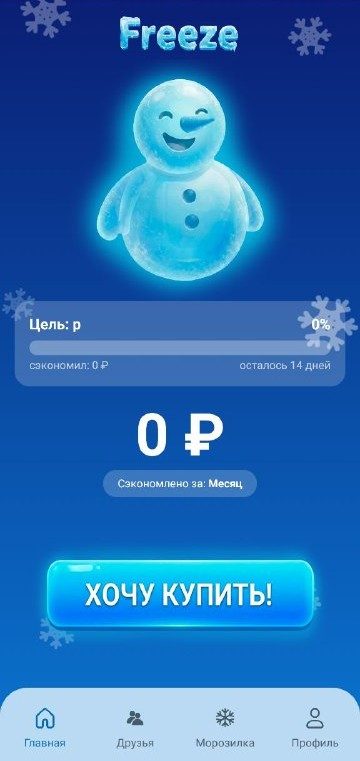
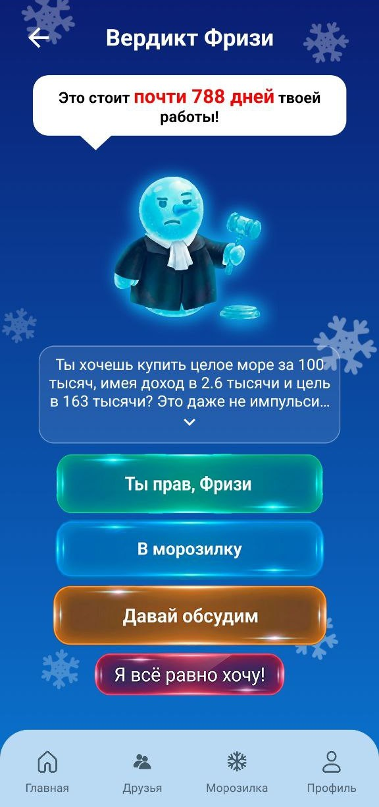
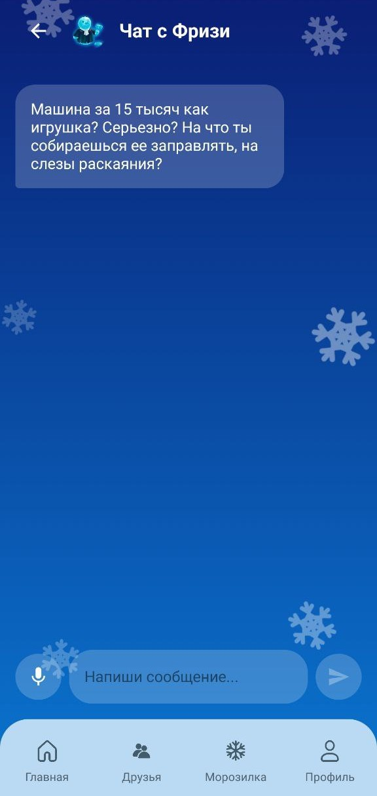

# Freeze App 🧊

**Freeze** - это приложение для андроида с ИИ агентом, созданное, чтобы помочь вам победить импульсивные покупки и достичь своих целей.

## 🏆 Достижения

> **Приложение было разработано в одиночку за 48 часов в рамках хакатона Cyber Garden 2025 и заняло 1-е место!** 🥇

🔗 [Пост от организаторов](https://vk.com/wall-157057531_3875)

## 📥 Приложение уже доступно в RuStore!

*Ссылка на скачивание: [RuStore](https://www.rustore.ru/catalog/app/com.vlaados.freeze)*

## 🎥 Демонстрация

Посмотрите короткое видео о том, как работает Freeze:

*Ссылка на видео: [YouTube](https://youtu.be/FDmzTh2kDr4)*

## 📱 Скриншоты

| Главный Экран | Вердикт о Покупке |
|:-----------:|:----------------:|
|  |  |

| Ожидание | AI Чат-Ассистент |
|:------------------:|:-----------------:|
|  |  |

## ✨ Основной Функционал

### 🛑 Контроль
- **Вердикт**: Перед покупкой приложение проводит вас через процесс отговаривания от покупки.
- **Дыхание**: Специальный экран с отведённым временем.
- **AI Консультация**: Можно общаться с AI-ассистентом, чтобы обсудить, соответствует ли покупка вашим целям.

### 🎯 Трекинг Целей
- **Мечта**: Установите четкую финансовую цель.
- **Финансовый Профиль**: Введите свой доход и ежемесячные сбережения для работы ИИ агента.
- **Слабости**: Определите свои специфические триггеры трат.

### 🤝 Совместные Накопления
- **Общие Цели**: Объединяйтесь с друзьями, чтобы копить на общие нужды.
- **Лента Друзей**: Наблюдайте за прогрессом друзей.

### 🧊 Морозилка
- Можно отложить покупки и добавить её на время в морозилку.

## 🛠️ Реализация и Стек Технологий

Основная информация о проекте:

- **Язык**: [Kotlin](https://kotlinlang.org/)
- **UI Фреймворк**: [Jetpack Compose](https://developer.android.com/jetbrains/compose).
- **Архитектура**: MVVM (Model-View-ViewModel).
- **Навигация**: Jetpack Navigation Compose.

## 🏁 Заключение
В итоге мне всего за 48 часов удалось сделать приложения которое идеально работает.

*На данный момент приложение не функционирует в связи с отключением базы данных*
